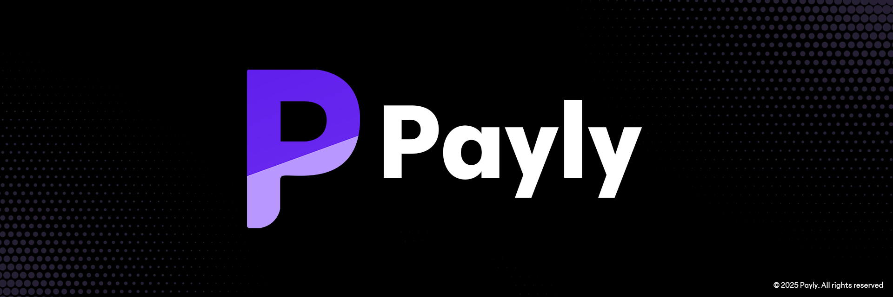

  

<h3 align="center">A simple yet effective way to split expenses amongst friends and family while avoiding awkward situations.</h3>

  ⭐ Star me on GitHub — your support motivates me a lot! 🙏😊

  <!-- GitHub Shields -->
  
  
  
  <!-- Project Shields -->
  
  

---

## 📖 Table of Contents
- [About](#-about)
- [🚀 Features](#-features)
- [🛠️ Tech Stack](#️-tech-stack)
- [🗺️ Roadmap](#️-roadmap)

---

## 🎯 About

Payly is a modern solution for effortlessly splitting bills and expenses. Whether it's for a group dinner, a shared vacation, or household bills, this app ensures transparency and fairness. Designed as a mobile and web application, Payly is currently in its Minimum Viable Product (MVP) stage, with a host of exciting features on the horizon. The core mission is to eliminate the awkwardness of financial conversations and make sharing expenses a seamless experience.

---

## 🚀 Features

Payly offers a straightforward and intuitive way to manage shared expenses with a variety of splitting options to suit every situation.

#### **💡 Expense Splitting**
*   **Equal Split:** Divide the bill equally among all participants with a single tap.
*   **Fixed Amount:** Assign specific amounts to different individuals.
*   **Percentage Split:** Distribute the cost based on custom percentages.

#### **📱 Cross-Platform Accessibility**
*   **Web Application:** A responsive and user-friendly interface accessible from any browser.
*   **Mobile Application:** *(In Progress)* A dedicated mobile app for managing expenses on the go.

---

## 🛠️ Tech Stack

This project is built with a modern and scalable tech stack to ensure a robust and flexible platform!

### Frontend (Web)

### Frontend (Mobile)

### Backend

### Database

---

## 🗺️ Roadmap

Payly is an actively developing project with many exciting features planned for the near future.

### **📊 Development Progress**

*   **Web App:** 🟩🟩🟩🟩🟩🟩🟩🟩⬜️⬜️ (80%)
*   **Mobile App:** Building up the mobile app.

### **🌟 Upcoming Features**

*   **🤖 AI-Powered OCR for Receipts:** Soon, you'll be able to simply scan your receipts and let our AI handle the rest!
*   **🔄 Recurring Expenses:** Create recurring expenses.
*   **🔔 Notifications and Reminders:** Get timely alerts for pending payments.
*   **💳 Payment Integration:** Settle debts directly within the app.